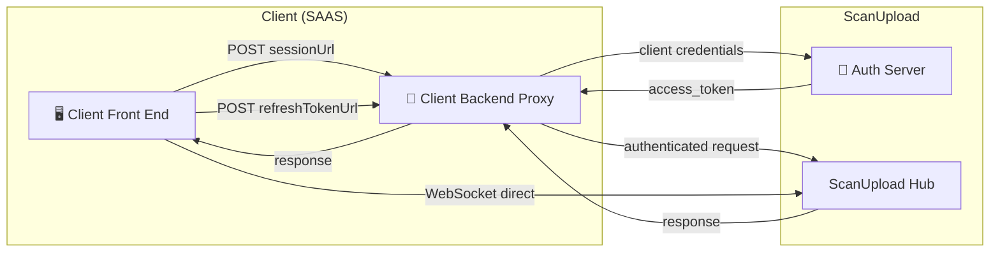

# @scanupload/qr-code-generator

A React component that displays a QR code allowing a mobile device to securely
upload files to a ScanUpload session. Once a mobile user scans the QR code and
uploads files, the desktop component receives real-time status updates via a
SignalR connection and renders a live preview of every uploaded file.

---

## Backend-end integrations

This official react client library is designed to work seamlessly with the
ScanUpload backend proxy:

- [ScanUpload.Api.Client](https://github.com/donaldasante/scanupload.api.client)
  – ScanUpload Backend proxy (dotnet)

## Table of Contents

- [Installation](#installation)
- [Backend API Requirements](#backend-api-requirements)
- [Usage](#usage)
- [Props Reference](#props-reference)
- [classNames Customisation](#classnames-customisation)
- [SignalR Events](#signalr-events)
- [File Preview Modes](#file-preview-modes)
- [Session Lifecycle](#session-lifecycle)

## Installation

The package is distributed as an ES module and CJS bundle with bundled CSS.

```bash
npm install @scanupload/qr-code-generator
```

### Peer dependencies

| Package     | Version |
| ----------- | ------- |
| `react`     | `>= 19` |
| `react-dom` | `>= 19` |

### Import the stylesheet

```ts
import "@scanupload/qr-code-generator/dist/index.css";
```

---

## Backend API Requirements

The component communicates with two endpoints on your **client backend proxy**
(a .NET application — see
[ScanUpload.Api.Client on NuGet](https://www.nuget.org/packages/ScanUpload.Api.Client/)).
The proxy is responsible for authenticating with the **ScanUpload Auth Server**
using OAuth 2.0 client credentials and forwarding requests to the **ScanUpload
Hub**. The component never holds client credentials — it only receives
short-lived Bearer tokens.

> **The SignalR WebSocket is the exception.** The WebSocket connection to
> `hubUrl` is opened directly from the browser to the **ScanUpload Hub** — it
> does not pass through your proxy.



## Usage

```ts
import { QrCodeGenerator } from "@scanupload/qr-code-generator";
import "@scanupload/qr-code-generator/dist/index.css";

export default function App() {
  return (
    <div className="flex items-center justify-center min-h-screen bg-gray-100">
      <form className="bg-white shadow-lg rounded-lg p-8 max-w-md">
        <QrCodeGenerator
          sessionUrl="/scanupload-api/session"
          refreshTokenUrl="/scanupload-api/token"
          showHeader={true}
          header="Upload files from mobile device"
          size="large"
          showLogo={true}
          clickQrCodeToReload={true}
          filePreviewMode="list"
          classNames={{
            qrWrapper: "rounded-none border-solid border-blue-500",
            reloadButton: "bg-red-500 hover:bg-red-700",
            header: "text-2xl font-bold text-purple-700",
          }}
        />
      </form>
    </div>
  );
}
```

---

## Props Reference

| Prop                  | Type                                         | Default   | Required | Description                                                                                                                                 |
| --------------------- | -------------------------------------------- | --------- | -------- | ------------------------------------------------------------------------------------------------------------------------------------------- |
| `sessionUrl`          | `string`                                     | —         | ✅       | URL of the endpoint that creates a ScanUpload session (`POST`).                                                                             |
| `refreshTokenUrl`     | `string`                                     | —         | ✅       | URL of the endpoint that returns a fresh Bearer token (`POST`).                                                                             |
| `header`              | `string`                                     | —         | ✅       | Text rendered in the header element (visible only when `showHeader` is `true`).                                                             |
| `showHeader`          | `boolean`                                    | `false`   |          | Whether to render the header above the QR code.                                                                                             |
| `showLogo`            | `boolean`                                    | `true`    |          | Whether to overlay the ScanUpload logo in the centre of the QR code.                                                                        |
| `clickQrCodeToReload` | `boolean`                                    | `false`   |          | When `true`, clicking the QR code triggers a session reload. When `false`, a separate _Reload_ button is shown beneath the QR code instead. |
| `size`                | `"small" \| "medium" \| "large" \| "xlarge"` | `"large"` |          | Controls the overall size of the QR code container.                                                                                         |
| `filePreviewMode`     | `"list" \| "grid"`                           | `"grid"`  |          | How uploaded files are displayed — as a grid of document tiles or a compact list.                                                           |
| `classNames`          | `QrCodeClassNames`                           | `{}`      |          | Slot-based Tailwind class overrides. See [classNames Customisation](#classnames-customisation).                                             |
| `style`               | `React.CSSProperties`                        | —         |          | Inline styles applied to the root `<section>`. Useful for injecting CSS custom properties.                                                  |

---

## classNames Customisation

Each key targets a specific UI region. Classes are merged with the built-in
defaults using **tailwind-merge**, so any Tailwind conflicts are always resolved
in favour of the override you supply.

| Key              | Element     | Description                                                                |
| ---------------- | ----------- | -------------------------------------------------------------------------- |
| `root`           | `<section>` | Outermost wrapper of the component.                                        |
| `loadingOverlay` | `<div>`     | Spinner overlay shown while the session is being created.                  |
| `errorOverlay`   | `<div>`     | Overlay shown when the session could not be created.                       |
| `errorButton`    | `<button>`  | Retry button inside the error overlay.                                     |
| `header`         | `<h1>`      | The header text element.                                                   |
| `qrWrapper`      | `<div>`     | Bordered box that wraps the QR code.                                       |
| `reloadButton`   | `<button>`  | Reload button shown when `clickQrCodeToReload` is `false`.                 |
| `hintText`       | `<p>`       | "Click QR code to reload" hint shown when `clickQrCodeToReload` is `true`. |
| `fileContainer`  | `<div>`     | Container for the file grid or list.                                       |

### Example

```tsx
<QrCodeGenerator
  classNames={{
    qrWrapper: "rounded-none border-solid border-blue-500",
    reloadButton: "bg-red-500 hover:bg-red-700",
    header: "text-2xl font-bold text-purple-700",
  }}
  ...
/>
```

### CSS custom properties

Use `style` to inject design tokens:

```tsx
<QrCodeGenerator
  style={{
    "--qr-accent": "#1d4ed8",
    "--qr-border": "#d1d5db",
  } as React.CSSProperties}
  ...
/>
```

---

## File Preview Modes

### `"grid"` (default)

Renders each file as a `DocumentPreviewer` tile with:

- A file-type icon colour-coded by extension (PDF → red, Word → blue, Excel →
  green, images → purple, etc.)
- A thumbnail for image files (when `thumbnailBase64` is provided by the server)
- An upload progress bar

### `"list"`

Renders all files as a compact `FileList` with:

- A 48 × 48 thumbnail (or a generic document icon if no thumbnail is available)
- File name (truncated) and size in KB

---

## License

MIT © Donald Asante
