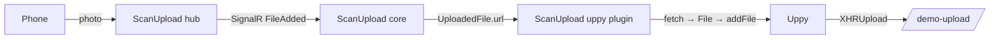

# Vue 3 + Uppy demo

A Vite + Vue 3 app that exercises [`@scanupload/qr-code-generator-uppy`](../../packages/uppy) end to end: scan a QR code with a phone, upload a photo, and watch it flow into Uppy and on to an upload endpoint.



## Run

From the monorepo root:

```bash
npm install
npm run build:uppy     # builds core + the Uppy plugin
npm run dev:vue-uppy
```

The app starts on https://localhost:5175. (`examples/vue-demo` also claims a port, so keep them distinct — this one is set in `vite.config.js`.)

Rebuild the package after changing anything under `packages/`; the demo resolves packages from their local `dist/`.

## Configure

Copy `.env.example` to `.env` and fill in:

```env
VITE_SESSION_URL=https://hub.scanupload.net/api/v2/front-end/session
VITE_CLIENT_ID=your-tenant-id
```

`npm run dev` loads `.env` and `.env.local`. `npm run dev:qa` layers the committed `.env.qa` (the shared QA hub) on top, overriding any key it also defines — use `.env.qa.local` if you want personal overrides in QA mode.

The browser talks to the hub directly, so the hub must allowlist the demo's origin (`https://localhost:5175`), or Test Mode must be enabled. See `examples/vue-demo/README.md` for the origin-testing and CSP walkthrough.

## Where the files go

`VITE_UPLOAD_ENDPOINT` is unset by default, so Uppy uploads to `/demo-upload` — a mock endpoint served by `vite.config.js` (in both `dev` and `preview`) that echoes the received byte count back as JSON. Point the variable at a real endpoint to bypass it:

```env
VITE_UPLOAD_ENDPOINT=https://your-backend.example.com/api/uploads
```

## What to look for

The page is one upload box split into two halves, plus a single status line:

| Half                 | Shows                                                                                                          |
| -------------------- | -------------------------------------------------------------------------------------------------------------- |
| **From your phone**  | The ScanUpload QR code for the session the plugin owns. Set `showFilePreviews` to `false` so it lists nothing. |
| **From this device** | The Uppy Dashboard drop zone — drop or browse for local files.                                                 |
| **Status line**      | `phone connected` / `phone offline`, how many files came from the phone, and how many have been uploaded.      |

Both halves feed the same Uppy instance, so phone files and dropped files end up in one list and are uploaded to the same endpoint.

The widget renders with `showFilePreviews: false` because Uppy already lists everything that arrived — showing the same files twice added nothing. The flag exists on every adapter; set it back to `true` to get the widget's own preview list.

```vue
<QrCodeGenerator :session-url="sessionUrl" :client-id="clientId" :core="core" :show-file-previews="false" />
```

`core` is what makes the halves share a session: `plugin.getCore()` is handed to the widget, so the QR code the phone scans is the session the plugin watches. Without it the widget would open a second session and the plugin would never see those uploads.

### Transient 404s are expected

The hub publishes a file's URL in `FileAdded` slightly before the blob is readable, so the first `GET` typically answers `404 FileUpload.FileNotFound` and the retry succeeds. Those 404s appear in the browser's network panel but are not failures — the plugin retries them automatically (six attempts, roughly 11.5 s of patience). Files that still fail can be re-queued with `plugin.retryFailed()`.

## Verify without a phone

`packages/uppy/smoke.mjs` drives the compiled plugin with a real Uppy instance and a local HTTP server, covering forwarding, duplicate suppression, deferred URLs, removal mirroring, a first-attempt 404 that retries successfully, and teardown:

```bash
npm run smoke --workspace=packages/uppy
```
