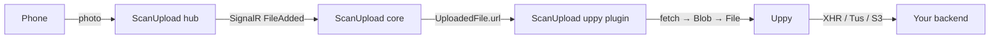

# @scanupload/qr-code-generator-uppy

Headless [Uppy](https://uppy.io/) plugin for the [ScanUpload](https://app.scanupload.net) hub.

It watches a ScanUpload session for files uploaded from a phone via QR code, downloads each one in the browser, and hands it to Uppy with `uppy.addFile()`. From that moment the file is an ordinary Uppy file — whichever uploader plugin you installed (XHR, Tus, S3, …) sends it wherever you want.

## Architecture



This package is fully decoupled: it is the only package in the monorepo that depends on Uppy, and every other ScanUpload package works with or without it.

## Install

```bash
npm install @scanupload/qr-code-generator-uppy @uppy/core
```

`@uppy/core` and `@scanupload/qr-code-generator-core` are peer dependencies, so you keep a single copy of each. `@uppy/core` v6 is ESM-only, and this package therefore ships an ES build only.

## Quick start

```ts
import Uppy from '@uppy/core';
import Dashboard from '@uppy/dashboard';
import XHRUpload from '@uppy/xhr-upload';
import ScanUpload from '@scanupload/qr-code-generator-uppy';

import '@uppy/core/css/style.min.css';
import '@uppy/dashboard/css/style.min.css';

const uppy = new Uppy({ autoProceed: true })
    .use(Dashboard, { inline: true, target: '#uppy-dashboard' })
    .use(ScanUpload, {
        sessionUrl: 'https://hub.scanupload.net/api/v2/front-end/session',
        clientId: 'your-tenant-id'
    })
    .use(XHRUpload, { endpoint: '/api/uploads', fieldName: 'files[]' });
```

With `autoProceed: true`, every photo the phone uploads is downloaded and pushed to your backend without any further user interaction. Leave `autoProceed` at its default (`false`) if you would rather have the user confirm the upload in Uppy's Dashboard.

## How it works

1. `install()` constructs and starts a `QrCodeGeneratorCore` — the same runtime the ScanUpload framework widgets use — and wires it to Uppy through `connectScanUploadFiles()` from the core package.
2. When the hub reports a file, the core bridge downloads `UploadedFile.url` with `fetch()`, retrying transient failures on a backoff schedule.
3. The response blob is wrapped in a `File` (preserving the original name and content type) and passed to `uppy.addFile()` together with ScanUpload metadata.
4. Hub-side removals, including a session reset, are mirrored into Uppy via `uppy.removeFile()`.
5. `uninstall()` aborts in-flight downloads and disposes the core.

Downloads are pooled (`maxConcurrentDownloads`, default `4`) so a session containing dozens of phone photos does not open dozens of parallel requests.

### The hard parts live in core

Downloading, retrying, de-duplicating, bounding concurrency and mirroring removals
are **not** implemented here — they live in
[`connectScanUploadFiles()`](../core#feeding-another-uploader), because every
adapter needs exactly the same behaviour. This plugin supplies only a sink:
"given a downloaded file, `uppy.addFile()` it", plus the option mapping.

The practical consequences:

- Every integration built on the bridge shares one retry policy, so a fix or a
  tuning change applies everywhere — including your own sinks.
- A custom loader for an uploader with no adapter is about ten lines — pass your
  own sink to `connectScanUploadFiles`.

## Options

| Option                   | Type                                         | Default                            | Description                                                             |
| ------------------------ | -------------------------------------------- | ---------------------------------- | ----------------------------------------------------------------------- |
| `sessionUrl`             | `string`                                     | — (required)                       | Endpoint that creates a ScanUpload session.                             |
| `clientId`               | `string`                                     | `undefined`                        | Tenant / Keycloak `client_id` sent with the session request.            |
| `autoResession`          | `boolean`                                    | `false`                            | Replace the session automatically when its TTL elapses.                 |
| `storage`                | `StorageAdapter`                             | browser `localStorage`             | Session cache adapter supplied to the core.                             |
| `fetchOptions`           | `RequestInit` (without `signal`)             | `{ credentials: 'include' }`       | Passed to every file download.                                          |
| `resolveUrl`             | `(file, state) => string \| Promise<string>` | `file.url`                         | Customise how a file's download URL is resolved (signed URLs, proxies). |
| `shouldForward`          | `(file, state) => boolean`                   | forward all                        | Skip specific hub files.                                                |
| `buildMeta`              | `(file, state) => object`                    | —                                  | Add extra Uppy metadata per file.                                       |
| `buildFile`              | `(blob, file, state) => Blob \| File`        | `new File([blob], name, { type })` | Customise what Uppy receives as `file.data`.                            |
| `source`                 | `string`                                     | `'ScanUpload'`                     | Uppy `file.source` value.                                               |
| `mirrorRemovals`         | `boolean`                                    | `true`                             | Remove the Uppy file when the hub drops it.                             |
| `maxConcurrentDownloads` | `number`                                     | `4`                                | Simultaneous file downloads.                                            |
| `maxDownloadAttempts`    | `number`                                     | `6`                                | Download attempts per file before reporting a failure.                  |
| `downloadRetryDelayMs`   | `number`                                     | `500` (backoff capped at 4 s)      | Wait before the first retry; doubles each attempt.                      |
| `onForwarded`            | `(file, uppyFileId) => void`                 | —                                  | Called after a file lands in Uppy.                                      |
| `onForwardError`         | `(error, file) => void`                      | Uppy Informer message              | Called when a file cannot be downloaded or added.                       |
| `onDownloadRetry`        | `(info, file) => void`                       | —                                  | Called before each download retry.                                      |

Any other Uppy plugin option (`id`, `locale`) is accepted as usual.

### Transient 404s are expected

The hub publishes a file's URL in `FileAdded` slightly _before_ the blob is readable, so the first `GET` commonly answers `404 FileUpload.FileNotFound` and the next attempt succeeds. The plugin retries transient statuses (`404`, `408`, `423`, `425`, `429`, `5xx`) and network errors with exponential backoff — six attempts over roughly 11.5 s by default — and never retries `400`/`401`/`403`, which retrying cannot fix.

A tight retry budget silently drops files the hub would have served a moment later, so prefer widening `maxDownloadAttempts` over removing the retries. Use `onDownloadRetry` to surface the attempts in your own UI; otherwise they are visible only as 404s in the browser's network panel. Files that still fail are recorded and can be re-queued with [`retryFailed()`](#api).

## Metadata

Every forwarded file carries these keys, in addition to whatever `buildMeta` returns (ScanUpload's own keys always win):

| Key                   | Description                                      |
| --------------------- | ------------------------------------------------ |
| `scanUploadFileId`    | The `UploadedFile.id` reported by the hub.       |
| `scanUploadSessionId` | The ScanUpload session id, or `null` if unknown. |
| `scanUploadUrl`       | The URL the file was downloaded from.            |

Because Uppy's metadata is typed per instance, widen your own meta type to keep `uppy.addFile()` type-safe:

```ts
import type { ScanUploadFileMeta } from '@scanupload/qr-code-generator-uppy';
import type { Body } from '@uppy/core';

interface MyMeta extends ScanUploadFileMeta {
    projectId: string;
}

const uppy = new Uppy<MyMeta, Body>({ meta: { projectId: 'p-42' } });
```

With `XHRUpload`'s default `formData: true`, these keys are sent as form fields on the upload request.

## Showing the QR code

The plugin owns the core, so a ScanUpload widget must bind to that same core or it will create a second session and display a different QR code. Every ScanUpload framework package accepts an optional `core` prop for exactly this purpose.

Get the core from the plugin:

```ts
const plugin = uppy.getPlugin<ScanUploadPlugin>('ScanUpload');
const core = plugin?.getCore();
```

### React

```tsx
import { QrCodeGenerator } from '@scanupload/qr-code-generator-react';
import '@scanupload/qr-code-generator-react/dist/index.css';

<QrCodeGenerator
    sessionUrl={sessionUrl}
    core={core} // binds to the plugin's session instead of creating one
    showHeader
    header='Scan to upload'
/>;
```

### Vue

```vue
<script setup lang="ts">
import { QrCodeGenerator } from '@scanupload/qr-code-generator-vue';
import '@scanupload/qr-code-generator-vue/dist/index.css';

const props = defineProps<{ core: QrCodeGeneratorCore | null }>();
</script>

<template>
    <QrCodeGenerator :session-url="sessionUrl" :core="core" show-header header="Scan to upload" />
</template>
```

### Svelte

```svelte
<script lang="ts">
  import { QrCodeGenerator } from '@scanupload/qr-code-generator-svelte';
  import '@scanupload/qr-code-generator-svelte/dist/index.css';

  export let core = null;
</script>

<QrCodeGenerator sessionUrl={sessionUrl} {core} showHeader header="Scan to upload" />
```

### Angular

```html
<sqg-qr-code-generator [sessionUrl]="sessionUrl" [core]="core" [showHeader]="true" header="Scan to upload"></sqg-qr-code-generator>
```

### Vanilla

```ts
import { QrCodeGeneratorElement } from '@scanupload/qr-code-generator-vanilla';

const widget = new QrCodeGeneratorElement({
    container: document.getElementById('widget')!,
    sessionUrl,
    core // omit to create a dedicated session
});
await widget.start();
```

When `core` is supplied, `sessionUrl`, `clientId` and `autoResession` on the widget are ignored — the core is configured and disposed by the plugin.

## API

| Member                            | Description                                                             |
| --------------------------------- | ----------------------------------------------------------------------- |
| `getCore()`                       | The `QrCodeGeneratorCore` this plugin drives.                           |
| `getState()`                      | Current ScanUpload state (connection, countdown, uploaded files).       |
| `subscribe(listener)`             | Subscribe to ScanUpload state changes; returns an unsubscribe function. |
| `retrySession()`                  | Tear down the session and start a fresh one.                            |
| `getUppyFileId(scanUploadFileId)` | Uppy file id for a hub file, once forwarded.                            |
| `getForwardedFiles()`             | Read-only `Map` of ScanUpload file id → Uppy file id.                   |
| `retryFailed()`                   | Retry files that previously failed to download or be added.             |

Failures are not retried automatically, so a permanently broken URL cannot re-fetch on every state change.

## Deployment notes

- **Two transfers per file.** The browser downloads the photo from ScanUpload and then uploads it to your backend. This is fine for phone photos; for very large files consider a server-to-server transfer instead.
- **CORS.** The `UploadedFile.url` must be fetchable from your page. Cross-origin plus `credentials: 'include'` requires the hub to answer with an explicit `Access-Control-Allow-Origin` (never `*`) and `Access-Control-Allow-Credentials: true`, or use signed URLs and set `fetchOptions` accordingly.
- **Uppy restrictions apply.** If the consumer's Uppy instance sets `restrictions` (max file size, allowed types, file count), a rejected file is reported through the Informer and via `onForwardError`, and is not retried unless you call `retryFailed()`.
- **`mirrorRemovals`.** With the default `true`, a hub session reset clears the matching files from Uppy too. Uppy refuses to drop a file from an in-flight upload when the installed uploader does not support individual cancellation; the plugin logs that case instead of throwing.

- **Transient 404s are expected.** The hub publishes a file's URL when it emits `FileAdded`, which precedes the blob becoming readable by up to about a second, so an immediate `GET` can legitimately return `404 FileUpload.FileNotFound`. The core retries `404`, `408`, `423`, `425`, `429` and `5xx` on a 500 ms → 4 s backoff (about 11.5 s of patience). It never retries `400`, `401` or `403` — those are configuration problems. See [`onDownloadRetry`](#options) to observe retries.

## Development

```bash
npm run build --workspace=packages/uppy   # or: npm run build:uppy (from the repo root)
npm run smoke --workspace=packages/uppy   # verify against a real Uppy instance
```

The smoke test drives the compiled plugin with a real `Uppy` instance and a local HTTP server standing in for the hub's file URLs. It covers forwarding, duplicate suppression, deferred URLs, a transient 404 that must be retried, removal mirroring and teardown, and needs no ScanUpload backend.

## License

MIT © Donald Asante
